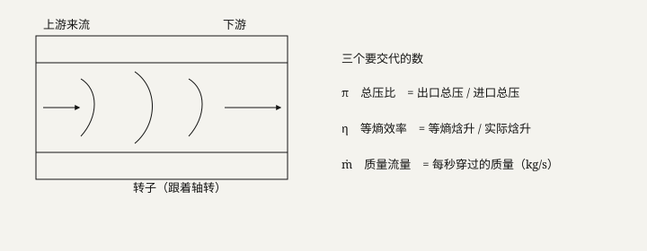

# 第 1 单元 · 机器、转子与三个气动输出

读完本单元，你必须能自己做三件事：

1. 指着 \\(\pi,\ \eta,\ \dot m\\) 说出中文名和定义，并说出各自的单位；
2. 说出 Rotor 37 是什么、不是什么；
3. 打开 `evidence/metrics.json`，读出冻住的三个 \\(R^2\\)（\\(R^2\\) 的公式到 U07 才展开，本章只要知道数在哪、分别对应谁）。

---

## 0. 开场：你已经会的（桥），与本书的读书规则

### 0.1 桥（这些词本书不再从零讲，直接当工具用）

压力（压强）、速度、温度、密度、质量、体积、力、功（力 × 沿力的方向的位移）、位移、内能、比热容（高中物理里的 \\(Q=cm\\Delta T\\) 那个 \\(c\\)）。
数学：比、百分数、导数、微分、向量、均值、标准差。

**就这些。** 除此之外，任何一个词本书都会在你第一次遇到它的地方当场定义。你在书里读到一个不认识的词，是教材的问题，不是你的问题。

### 0.2 零搜索协议（全书统一，从本单元开始）

1. 每个新词第一次出现时，必须当场给出：**中文名 / 英文或符号 / 单位 / 一个具体数字例子**。
2. 每个定义里出现的词，只允许是三类：① 上面 0.1 的桥词；② 本章前面已经定义过的词；③ 写着「（U0X 才讲，这里只记名字）」的词。
3. 每一节开头先给你一张**术语依赖链**：这一节先学什么、后学什么、顺序为什么不能反。
4. 你读到任何一句里出现没定义过的生词，就停下来把它圈出来——这是教材违规，直接告诉我，我来补。
5. 每个重要公式后面，都跟着一个代入具体数字、一步步算完的例子。

---

## 1.1 画面：一台轴流压气机在干什么



**本节依赖链：**

```text
做功 → 压气机 / 涡轮 → 转子 / 静子 / 级
      → 静温 / 总温、γ、R → 声速 → 马赫数
      → 亚音速 / 超音速 / 跨音速 → Rotor 37
```

### 1.1.1 拆词（一）：机器长什么样

| 中文 | 英文 | 符号 | 一句定义（只用桥词） |
|---|---|---|---|
| 功 | work | \\(W\\) | 力 × 沿力的方向的位移，单位 J（焦耳）。高中物理就有 |
| 做功 | do work | — | 把一个力作用在物体上、物体沿力的方向动了，就说这个力做了功 |
| 压气机 | compressor | — | 一台把空气压得更紧（压强升高）的机器。它**消耗**外面送进来的功 |
| 涡轮 | turbine | — | 反过来：高温高压气体膨胀，**把功交出来**，推着它转。压气机与涡轮的做功方向正好相反 |
| 轴流 | axial flow | — | 「轴」+「流」：空气大致**顺着轴的方向**流过机器（不是转着圈往外甩） |
| 叶片 | blade | — | 机器里一圈一圈装的、带弧度的金属片。转的排推空气，不转的排导空气 |
| 转子 | rotor | — | 跟着轴一起**转**的那排叶片，对气体做功 |
| 静子 | stator | — | 固定不转的那排叶片。它把转子刚甩出来的高速气流理顺，让速度降下来，把**动能**（\\(\\tfrac12 mv^2\\)，高中物理）收回成**静压**（见 1.1.2 下的补注） |
| 级 | stage | — | 通常 = 一排转子 + 一排静子。很多级沿轴串起来，就是一台多级轴流压气机 |

**补注：静压（static pressure，\\(p\\)）。** 这是第一个新词，现在钉死：气体本身的热力学压力，你**跟着气流一起走**时用压力表测到的那个值，单位 Pa（帕斯卡）。1 个标准大气压 ≈ 101.3 kPa（千帕）≈ 101300 Pa。它和「气流停下来后压力升高」这件事的对比，在 1.2.1 讲。

**画面（用上面这些词说一遍）。** 一台轴流压气机 = 一根转轴，轴上装了很多排叶片：转的排（转子）和不转的排（静子）交替。空气沿轴流进去，每经过一个「级」，转子就推它一下，它的压强和温度就升高一点。工程师至少要三个数，才知道「这一级干得怎么样」：**压得猛不猛、浪费少不少、每秒过多少气**。这三个数就是 1.2 节的 \\(\pi,\ \eta,\ \dot m\\)。

### 1.1.2 拆词（二）：速度怎么衡量——声速、马赫数、跨音速

| 中文 | 英文/符号 | 单位 | 一句定义 | 数字例子 |
|---|---|---|---|---|
| 静温 | static temperature, \\(T\\) | K | 气体本身的热力学温度：跟着气流一起走、温度计插在气流里测到的值。0 °C = 273.15 K | 常温空气 \\(T\\approx 288\\) K |
| 总温 | total temperature, \\(T_t\\) | K | 把气流**刹停**（速度降到 0）后测到的温度。一定比静温高，因为动能变成了内能 | 见 1.2.1 的思想实验 |
| 比热比 | ratio of specific heats, \\(\\gamma\\) | 无 | 定压比热 ÷ 定容比热（这两个比热在 1.2.3 定义）。空气常取 1.4 | \\(\\gamma_{\\text{air}}=1.4\\) |
| 气体常数 | gas constant, \\(R\\) | J/(kg·K) | 每个气体一个固定值的常数，出现在它的状态方程里。空气 \\(R\\approx 287\\) | 287 J/(kg·K) |
| 声速 | speed of sound, \\(a\\) | m/s | 小扰动（比如你喊一声）在该气体里传播的速度。空气里：\\(a=\\sqrt{\\gamma R T}\\)，**这里的 \\(T\\) 是静温**，不是总温 | 15 °C 空气里 \\(a\\approx 340\\) m/s |
| 马赫数 | Mach number, \\(M\\) | 无 | 当地流速 ÷ 当地声速：\\(M=|v|/a\\)。它是「你飞得比声音快几倍」的尺子 | 高铁 350 km/h ≈ 97 m/s，\\(M=97/340\\approx 0.29\\)；\\(M=2\\) 就是 2 倍声速 |
| 亚音速 | subsonic | — | \\(M<1\\)：流得比声音慢 | \\(M=0.29\\) 的高铁气流 |
| 超音速 | supersonic | — | \\(M>1\\)：流得比声音快 | 战斗机 \\(M=2\\) |
| 跨音速 | transonic | — | **同一个流场里，有的地方亚音速、有的地方超音速**。「跨」就是「跨在 1 的两边」 | 叶尖 \\(M>1\\) 而叶根 \\(M<1\\) 的转子 |

**一个必须会的小计算。** \\(\\gamma=1.4\\) 时，\\((\\gamma-1)/\\gamma = 0.4/1.4 \\approx 0.2857\\)。这个 0.2857 后面会反复出现，先算对。

**声速公式的陷阱（练习题会考）。** \\(a=\\sqrt{\\gamma R T}\\) 里的 \\(T\\) 必须用**静温**。谁错用了总温，就会把声速算大，于是把马赫数算小，把超音速流误判成亚音速。

### 1.1.3 Rotor 37 是什么、不是什么

**是什么（一句话）。** NASA Rotor 37 是**公开的跨音速压气机转子基准件**：美国 NASA 公开的一套叶片几何、工况（转速、压力等）和大量实验结果。全世界做压气机的人拿它当「标准题」，检验自己的计算方法和软件准不准。Rotor = 转子；37 只是编号，不用管。

**不是什么（三条红线，说错就违规）。**

1. **不是涡轮。** 涡轮是气体膨胀把功交出来；Rotor 37 是压气机转子，方向反了。
2. **不是涡扇整机，也不能叫「涡扇叶片」。** 涡扇 = 一整台航空发动机：最前面的大风扇 + 多级压气机 + 燃烧室 + 涡轮 + 尾喷管。Rotor 37 只是其中「一排跨音速压气机转子」的公开基准件，不是从某台涡扇上拆下来的，更不是整台涡扇。
3. **不是我们实验室自己铣的实验件。** 它的数据和几何是公开数据集提供的，见 1.3。

**一个背景引子（只是引子，不是我们的对象）。** 2026 年 2 月，德国 KIT 的一台**无压气机**氢燃机跑了 303 秒。这条新闻只是说明「压气机很难、有人想绕开它」的行业背景。它**不是**本项目计算的那片叶子。谁在汇报里说「我们算的就是 KIT 那台」，直接违规。

**本节自检（不看上文能答出来才算过）：**

- [ ] 压气机消耗功还是交出功？涡轮呢？
- [ ] 「跨音速」的「跨」跨的是什么？
- [ ] 声速公式里的 \\(T\\) 用静温还是总温？用错了会怎样？
- [ ] Rotor 37 是压气机转子还是涡轮？涡扇这个词为什么不能套上去？

### 练习 1.1

**U01-S1-Q01 [易]【选】** Rotor 37 是  
A. 涡轮静子  
B. 涡扇整机  
C. 跨音速压气机转子  
D. 本实验室自己铣的实验件  

**U01-S1-Q02 [易]【选】** 一级里跟着轴转、对气体做功的是  
A. 静子  
B. 转子  
C. 燃烧室  
D. 尾喷管  

**U01-S1-Q03 [中]【填】** 马赫数 = 当地流速 / ______。  

**U01-S1-Q04 [中]【填】** KIT 303 秒在叙事里是______（填「引子」或「本项目对象」）。  

**U01-S1-Q05 [中]【问】** 压气机和涡轮在「做功方向」上差在哪一句？  
**U01-S1-Q06 [中]【问】** 「跨音速」的「跨」跨的是什么？  
**U01-S1-Q07 [中]【问】** 为什么本项目对象不能说成「涡扇叶片」？  
**U01-S1-Q08 [中]【问】** 静子在常规级里干什么？本数据集有没有单独的静子标签？  
**U01-S1-Q09 [中]【问】** 声速公式里的 \\(T\\) 是静温还是总温？写错会怎样？  
**U01-S1-Q10 [难]【问】** 只用「压气机 / 转子 / 跨音速 / 公开基准」四词，向没听过 Rotor 37 的人介绍它（不超过四句）。

---

## 1.2 三个数：π、η、ṁ

**本节依赖链：**

```text
静压 → 等熵（熵 / 可逆 / 绝热）→ 总压 / 总温 → 总压比 π
内能 → 焓 → 比热 cp、cv → γ、R → 量热完全气体 → 等熵关系 → 等熵效率 η
密度、截面 → 质量流量 ṁ → 喉部 → 堵塞
```

### 1.2.1 静压与总压的思想实验（π 的地基）

**静压 \\(p\\)**（1.1.1 已定义）：跟着气流一起走测到的压力，单位 Pa。

**总压（滞止压）\\(p_t\\)**：把气流**等熵地刹停**（速度降到 0）时，压力升到的那个值。思想实验：拿一根头部封死的小管，正对着气流插进去——管口前的气流被顶住、停下来，那里压力会升到 \\(p_t\\)。流速越大，停下来的瞬间压力涨得越多。低速近似下 \\(p_t \\approx p + \\tfrac12 \\rho v^2\\)（\\(\rho\\) 是密度，\\(\tfrac12\\rho v^2\\) 就是单位体积的动能）；**压气机里速度很高，这个低速近似不能用，只用来建立直觉**——你要记住的结论只有一句：总压 ≥ 静压，速度越大差得越多。

**总温 \\(T_t\\)**（1.1.2 已给定义）：同样这个「刹停」思想实验里的温度。刹停时动能变成内能，所以 \\(T_t \\ge T\\)。

**等熵（isentropic）**——这个词是 1.2 全节的轴，必须拆开钉死：

- 熵（entropy，符号 \\(S\\)）：热力学里衡量「乱」的物理量。摩擦、激波、掺混都会让熵**增加**，而且增加的这部分再也回不来（通俗说：乱了就收不回）。这个词高中没有，第一次出现就必须定义，现在定义完了。
- 等熵 = 熵不变 = 同时满足两条：① **可逆**（能原路倒回去、不留任何痕迹）；② **绝热**（不跟外界交换热量）。
- 对压气机，等熵的意义：**同样的压比，等熵过程耗功最少**。真实过程有摩擦、激波、分离，总比等熵多耗功。所以等熵是「满分线」，用来给真实过程打分——这就是下一小节的效率。

### 1.2.2 第一个数：总压比 π

**总压比**（total pressure ratio，\\(\pi\\)，无单位）：

\\[
\\pi=\\frac{p_{t2}}{p_{t1}}
\\]

\\(p_{t1}\\) = 进口总压，\\(p_{t2}\\) = 出口总压。**数字例子**：进口总压 100 kPa，出口总压 210 kPa，\\(\\pi=210/100=2.1\\)。\\(\\pi=2.1\\) 的意思就一句话：**出口总压是进口总压的 2.1 倍**。\\(\\pi>1\\) 才是在压缩；\\(\\pi<1\\) 说明在减压。

**为什么业内看总压比、不看壁面静压比？** 因为转子一边加速气体一边加压，静压里混着速度变化；而下一站（燃烧室）面对的是还在流动的气。总压把速度的贡献也折算进去，才是「压气机把气体的能量真正抬上去多少」的尺子。单看壁面静压比，会漏掉速度那笔账。

本项目数据里，这个字段叫 `Compression_ratio`（压缩比）。**π 的中文名就写「总压比」。**

### 1.2.3 焓、比热与 γ 的来历（η 的地基）

**内能 \\(u\\)**（桥）：气体分子无规则运动携带的能量，单位 J/kg（每千克气体多少焦耳）。高中物理有「内能」这个词，这里只是给符号。

**焓（enthalpy，\\(h\\)）**：单位质量气体的 \\(u + p/\\rho\\)，单位 J/kg。拆开讲：气体被压缩时，一边自己的内能涨，一边还要「排开」周围的气体（这一份功就是 \\(p/\\rho\\) 那项）。两笔账一起记，这个合账叫焓。**压气机对气体做功，气体的焓就升高**——记住这一句就够本章用。**滞止焓 / 总焓 \\(h_t\\)**：把气刹停后它含的焓（动能也折算进去了）。压气机做功，主要抬的就是它。

**比热 \\(c\\)**（桥的延伸）：高中 \\(Q=cm\\Delta T\\) 里的 \\(c\\)，就是「1 kg 气体温度升高 1 K 需要多少热量」，单位 J/(kg·K)。

- **定压比热 \\(c_p\\)**：压力保持不变时升温 1 K 需要的热量；
- **定容比热 \\(c_v\\)**：体积保持不变时升温 1 K 需要的热量。

因为压力不变时气体升温还要膨胀对外做功、要多吸热，所以 \\(c_p>c_v\\)。空气 \\(c_p\\approx 1.005\\) kJ/(kg·K)。

**比热比 \\(\\gamma = c_p/c_v\\)**：空气约 1.4（1.1.2 已经用过，这里给出处）。**气体常数 \\(R = c_p - c_v\\)**：空气约 287 J/(kg·K)。

**量热完全气体（calorically perfect gas）**：一种简化气体模型，两条假设：① 比热是常数（不随温度变）；② 满足状态方程 \\(p=\\rho R T\\)。空气在压气机常用的温度压力范围里，可以这样近似。教材后面所有「等熵关系」都建立在这个模型上。

**等熵关系（必须会用的公式）。** 对量热完全气体，沿等熵过程，总压比和总温比绑在一起：

\\[
\\frac{p_{t2}}{p_{t1}}=\\left(\\frac{T_{t2}}{T_{t1}}\\right)^{\\gamma/(\\gamma-1)},
\\qquad
\\text{反过来：}\\quad
\\frac{T_{t2}}{T_{t1}}=\\left(\\frac{p_{t2}}{p_{t1}}\\right)^{(\\gamma-1)/\\gamma}=\\pi^{0.2857}
\\]

**数字例子**：\\(\\pi=2.1\\) 时，\\(\\pi^{0.2857}=2.1^{0.2857}\\approx 1.236\\)，意思是：如果这一级真的等熵，压到 2.1 倍总压，「只需要」总温升到 1.236 倍。

### 1.2.4 第二个数：等熵效率 η

**等熵效率（总对总）**（isentropic efficiency, \\(\\eta\\) 或 \\(\\eta_{tt}\\)，无单位）：

\\[
\\eta_{tt}=\\frac{\\pi^{(\\gamma-1)/\\gamma}-1}{T_{t2}/T_{t1}-1}
\\]

逐项说：

- **分子** \\(\\pi^{0.2857}-1\\)：同样压比、如果过程等熵，「应该」有的无量纲温升（1.2.3 刚算过：\\(\\pi=2.1\\) 时是 0.236）；
- **分母** \\(T_{t2}/T_{t1}-1\\)：**实际**的无量纲温升；
- 「总对总」两个「总」：进口出口都用**总**压、**总**温。不是壁面静压、不是静温。

**完整算例（跟着算一遍）。** \\(\\pi=2.1\\)，实际总温比 \\(T_{t2}/T_{t1}=1.30\\)：

\\[
\\eta=\\frac{2.1^{0.2857}-1}{1.30-1}=\\frac{1.236-1}{0.30}=\\frac{0.236}{0.30}\\approx 0.79
\\]

意思是：理想（等熵）过程只要实际耗功的 79% 就够压到同样的压比；剩下 21% 被摩擦、激波、分离白白耗掉了。

**为什么 η 一定 ≤ 1？** 热力学第二定律（一句话版：摩擦和激波这类「乱」只会增加、不会自动消失，所以真实过程永远比理想过程多耗功）。实际温升永远 ≥ 等熵温升 → 分母 ≥ 分子 → \\(\\eta\\le 1\\)。\\(\\eta>1\\) 违反第二定律，是不可能的。顺带记住效率低的三个常见来源（U03 细讲）：**附面层摩擦、激波、流动分离**。

**这一句和后面损失函数的联系（U06 细讲）。** 训练网络时，损失里对 \\(\\eta\\) 的输出有一个「不许超过 1」的边界惩罚：把越界的输出往回压。这只是一种**输出边界约束**，不是把热力学方程写进网络。

**数字例子（本项目）。** \\(\\eta=0.9173\\) 的意思：同样压比，等熵过程需要实际耗功的 91.73%。本项目数据里 \\(\\eta\\) 的取值范围很窄（见 1.2.6），字段叫 `Efficiency`。**η 的中文名就写「等熵效率」。**

### 1.2.5 第三个数：质量流量 ṁ

**质量流量**（mass flow rate，\\(\\dot m\\)，单位 kg/s）：**每秒穿过选定截面的气体质量**。

\\[
\\dot m=\\int_{\\text{截面}}\\rho\\,\\mathbf{u}\\cdot\\mathbf{n}\\,dA
\\]

拆开读（积分号就是「把每一小块加起来」）：\\(\rho\\) 密度；\\(\mathbf{u}\\) 当地速度；\\(\mathbf{n}\\) 截面的法向（垂直方向）；\\(\\mathbf{u}\\cdot\\mathbf{n}\\) = 速度沿垂直方向的分量；\\(dA\\) 一小块面积。合起来：**在截面上，把「密度 × 垂直速度」逐块加总**。均匀流动时简化成 \\(\\dot m\\approx\\rho v A\\)（\\(A\\) 是截面积）。

**数字例子（建立手感）。** 本项目流量顶到约 21.74 kg/s。空气密度按 1.2 kg/m³ 估：\\(21.74/1.2\\approx 18\\) m³/s——相当于**每秒把约 18 立方米的空气（一间小教室的体积）吞进去**。

**喉部与堵塞。** 喉部（throat）= 相邻两片叶片之间通道里**最窄的那个截面**（U03 细讲几何）。堵塞（choke）= 流量大到喉部流速正好等于声速之后，再降下游压力，流量**几乎不再增加**——因为喉部已经到了声速，后面的信息传不过去了。本项目的数字：\\(\\dot m_{\\max}\\approx 21.74\\) kg/s 就在这个边上，而**那一点的 \\(\\eta\\) 掉到约 0.873**。为什么流量顶到边、效率会掉？因为通道里激波变强、附面层被顶到分离（U03 讲原因，这里只记数字和方向）。**ṁ 的中文名就写「质量流量」。**

### 1.2.6 三个数怎么凑成一个「评价」：窄带、权重、约束

**窄带问题。** 本项目 1000 组数据里，\\(\\eta\\) 只在大约 **0.045** 宽的窄带里变（\\(\\pi\\) 和 \\(\\dot m\\) 的变化范围大得多）。预测错一点点，相对这条窄带就显得大，所以 \\(\\eta\\) 最难拟合——这个事实后面会反复出现（U06、U07 都会回来看它）。

**损失权重。** 训练网络时，三个输出的误差在损失里不是等权的：\\(\\pi\\) 权重 1、\\(\\dot m\\) 权重 1.5、\\(\\eta\\) 权重 3（最难的那个加倍盯）。**权重是超参数，不是物理定律**——意思是：它是我们调出来的设置，换一组也能训，只是结果不同；它不是从任何物理方程推出来的。

**约束（找最优解时设的底线）。** 优化时要求 \\(\\pi\\ge 1.8\\) 且 \\(\\eta\\ge 0.84\\)。低于这两条线的候选，直接判不合格。

**本节自检（不看上文能答出来才算过）：**

- [ ] 总压和静压差在哪个「刹住」的思想实验上？
- [ ] \\(\\pi=2.1\\) 是什么意思？\\((\\gamma-1)/\\gamma\\) 算得出来吗（0.2857）？
- [ ] \\(\\eta_{tt}\\) 的分子、分母各是什么？为什么 \\(\\eta\\le 1\\)？
- [ ] 堵塞之后再降下游压力，流量会怎样？本项目 21.74 kg/s 那个点的 \\(\\eta\\) 大约是多少？

### 练习 1.2

**U01-S2-Q01 [易]【选】** \\(\\pi\\) 的定义是  
A. 叶面静压均值比  
B. \\(p_{t2}/p_{t1}\\)  
C. 背压 / 进口静压  
D. \\(\\Omega/P\\)  

**U01-S2-Q02 [易]【选】** \\(\\dot m\\) 的 SI 单位  
A. Pa  
B. rad/s  
C. kg/s  
D. K  

**U01-S2-Q03 [中]【填】** \\(\\pi,\\eta,\\dot m\\) 的中文：______、______、______。  

**U01-S2-Q04 [中]【填】** \\(\\gamma=1.4\\) 时 \\((\\gamma-1)/\\gamma=\\)______。  

**U01-S2-Q05 [中]【问】** 总压和静压差在哪一个「刹住」的思想实验？  
**U01-S2-Q06 [中]【问】** 为什么等熵过程是压气机效率的参照？  
**U01-S2-Q07 [中]【问】** \\(\\eta>1\\) 违反哪一条？后面损失里如何表达（不要说 PINN，本章还没讲 PINN）？  
**U01-S2-Q08 [中]【问】** 「总对总」两个「总」各指什么？  
**U01-S2-Q09 [中]【问】** 为什么不把壁面静压比当主指标？  
**U01-S2-Q10 [难]【问】** 证明等熵且量热完全时 \\(\\eta_{tt}=1\\)。本数据为何不能全落在这条线上（至少两点）？

---

## 1.3 这三个数在本仓库里怎么出现

**本节依赖链：**

```text
仿真 / CFD → RANS（只记名字，U04）→ 数据集 / 标签
→ 特征（只记名字，U05）→ 代理模型 → 留出集
→ R²（只记「打分标准」，U07 给公式）→ ONNX → SU2
```

### 1.3.1 电脑与仓库 mini 词表（全书共用，先钉死）

| 词 | 一句定义 |
|---|---|
| 仓库（repository） | 把整个项目的所有文件放在一起的地方。在电脑里是一个文件夹，同步到网上就是 GitHub 上的项目页面 |
| 目录 / 文件夹（directory / folder） | 装文件的抽屉。仓库里有 `evidence`、`data`、`backend` 等好几个 |
| 文件路径（path） | 一个文件在哪里的「地址」，用 `/` 分层。`evidence/metrics.json` 读作：evidence 文件夹里的 metrics.json 文件 |
| 字段（field / column） | 表格竖列的名字。比如 `Efficiency` 这一列里全是 η 的数 |
| CSV | 一种纯文本表格：每行一条记录，每列用逗号分开。Excel 能直接打开。本项目的数据表就是 CSV |
| JSON | 一种把「名字 : 值」写成文本的格式。`metrics.json` 里写 `"Efficiency": 0.9561`，意思就是：名叫 Efficiency 的那个数是 0.9561 |
| KB / MB | 文件大小单位，1 MB = 1024 KB。比如模型文件约 2.11 MB |

### 1.3.2 贵的计算与便宜的计算：CFD 与代理

**仿真（simulation）**：在电脑上模拟真实流动，算出一片叶子周围的压力、温度、速度。

**CFD**（Computational Fluid Dynamics，计算流体力学）：仿真流体的一种通用做法——把描述空气流动的方程交给电脑，在叶片几何上一格一格地解。一次 CFD 可能要算**几小时到几天**，所以它是「贵的计算」。

**RANS**（Reynolds-Averaged Navier-Stokes，一种 CFD 的做法）：**名字先记，U04 才拆**。这里只需要知道：数据集里每个样本的三个标签，就是别人用 RANS 这种 CFD 算出来的。

**代理模型（surrogate）**：**用已经算过的贵仿真当老师，训出一个便宜的「输入 → 输出」函数**。输入一串描述叶子的数（1.3.4 说是什么数），输出立刻吐出 \\(\\pi,\\eta,\\dot m\\)，不用再跑一次 CFD。便宜到什么程度：单点推断约 0.1 毫秒；贵到什么程度：一次 CFD 按小时起。**代理代替的是「再跑一次 CFD 算出 π、η、ṁ」这件事。**

### 1.3.3 数据集与标签

**标签（label）**：每个样本的「标准答案」——这里就是三列数 \\(\\pi,\\eta,\\dot m\\)。**注意：这些标签是数据集作者用 RANS 算的，不是我们算的。** 我们自己的 SU2 还只有一次未收敛的粗网格（U04 讲「未收敛」是什么意思），现在**不能**替代人家的标签。

**PLAID**：本项目用的公开数据集的名字。带标签的样本约 **1000 组**。它另外给了一个官方的 200 组测试集，但**标签是隐藏的**（只给输入、不给答案），所以官方测试集上我们算不出 \\(R^2\\)——本章能报的 \\(R^2\\) 只有我们自己留出集上的。

**特征（features）**：描述一片叶子的一串数字。本项目每片叶子被压成 **74 个数**（怎么来的在 U05 讲，这里只记名字）。输入代理模型的不是照片，是这 74 个数。

### 1.3.4 留出集与 R²（先记名字，U07 给公式）

**留出集（holdout）**：训练时**完全藏起来不看的 100 组样本**（本项目 \\(n=100\\)，用 `random_state=42` 这个随机种子决定怎么藏），等模型训完，再拿它们打分。就像考前把 100 份真题锁起来，考完再对答案。

**R²（coefficient of determination，判定系数）**：打分的标准之一。**1 = 完美；0 = 和「全猜平均数」一样糟**。公式到 U07 展开，本章只要知道数在哪、谁对应谁。

**冻住的三个数（公开数字只认 `evidence/metrics.json`，背下来）：**

\\[
R^2_\\pi=0.9844,\\qquad R^2_\\eta=0.9561,\\qquad R^2_{\\dot m}=0.9827
\\]

读法：代理模型在留出集 100 组上，压比预测的 \\(R^2\\) 是 0.9844，效率是 0.9561，流量是 0.9827。**η 最差，原因就是 1.2.6 的窄带问题。**

**基线（baseline）**：一个更简单的对比网络，叫 **MLP（多层感知机，U06 拆）**，它在同样留出集上是 0.9664 / 0.9132 / 0.9492。我们的网络（残差结构）比它好，尤其 η 从 0.9132 提到 0.9561。对比的意义：新方法要打得过一个「老实人」，数字才有说服力。

### 1.3.5 三个端点数字（代理自己找到的，不是叶子）

代理模型在 74 维输入空间里搜索，找到三个方向的极端点（找法叫 NSGA-II，U10 讲）：

- **最大效率** \\(\\eta_{\\max}=0.9173\\)。训练样本的 η 平均是 0.8703。相对提升：\\((0.9173-0.8703)/0.8703 = 0.047/0.8703 \\approx 5.4\\%\\)。**+5.4% 的分母是「训练均值」，不是「公开基准设计效率」**——写成「比公开设计效率高 5.4%」就错了两个地方：分母不对，而且 0.9173 是代理吐的数、没经过 CFD 复核。
- **最大流量** \\(\\dot m_{\\max}=21.74\\) kg/s，**该点 \\(\\eta\\approx 0.873\\)**（效率掉下来了，1.2.5 说过原因在堵塞边上的激波与分离）。
- **最大压比** \\(\\pi_{\\max}=2.1073\\)。

注意：最大 η 的点和最大 ṁ 的点**不是同一个点**——流量顶到边，效率就掉，所以两个极端分家。

**为什么只有这三个数还不能说「找到了一片好叶子」？** 反例（单元卷会考）：三个数都漂亮，但①对应的 74 个数**造不出一片真叶子**（U05 讲为什么）；②就算能造，应力、振动、寿命一概没算；③这个点可能落在训练数据边上（外推区），代理自己都不该被信任。所以 0.9173 必须永远带着限定词说：「代理模型预测、相对训练均值」。

### 1.3.6 网页上那格「滞止焓升」是什么（算例）

预测页有一格叫滞止焓升 \\(\\Delta h_0\\)，公式：

\\[
\\Delta h_0\\approx c_p\\,T_{t1}\\left(\\pi^{0.2857}-1\\right),
\\qquad
c_p=1.005\\ \\mathrm{kJ/(kg\\cdot K)},\\quad T_{t1}=288.15\\ \\mathrm{K}
\\]

这是**等熵焓升的估计**：把预测出来的 \\(\\pi\\) 代进 1.2.3 的等熵关系，估一个参考数。

**完整算例（\\(\\pi=2.05\\)，单元卷会考）：**

1. \\(2.05^{0.2857}\\approx 1.2277\\)（计算器按：2.05，然后 \\(x^y\\)，输 0.2857）；
2. \\(1.2277-1=0.2277\\)；
3. \\(c_p T_{t1}=1.005\\times 288.15\\approx 289.6\\) kJ/kg；
4. \\(\\Delta h_0 \\approx 289.6\\times 0.2277\\approx 66.0\\) kJ/kg。

**三个边界（这里最容易说错，钉死）：**

1. 它只依赖 \\(\\pi\\)，随 \\(\\pi\\) 单调上升；**η 不进这个公式**；
2. 它**不是网络的一个输出**——网络只输出 \\(\\pi,\\eta,\\dot m\\) 三个数；
3. 它**不是把做功方程写进网络**。真正由转子做功算焓升的公式叫欧拉功方程（U02 讲），页面这格不是它。

### 1.3.7 边界与红线（对外说话前先过一遍）

1. **三个数的「真」是对 PLAID 标签的真，不是对物理世界的真。** 我们自己的 SU2 还没收敛（U04），物理闭环没关。
2. **0.9173 是代理的信念**，不是「找到了效率 91.73% 的叶片」。
3. **+5.4% 的分母是训练均值**，不是公开基准。
4. 三个输出都是气动标量，没有应力、热、寿命，所以**现在不能叫多学科设计优化（MDO，U12 拆）**。
5. 74 维是统计约化，**不是可加工的几何旋钮**（U05）。
6. 公开数字只允许出自 `evidence/`，本单元的冻定数在 `evidence/metrics.json`。
7. 代理只在训练分布附近可信；输入超出范围时系统会拒绝回答（API 返回 422 状态码，U02 讲）。
8. 加速比不写「100,000×」——那没有把离线 1000 组 CFD 的成本算进去。

### 1.3.8 仓库指认（现在就打开仓库做一遍）

| 动作 | 打开什么 | 看到什么 |
|---|---|---|
| 1 | `evidence/metrics.json` → 找 `surrogate_holdout` → 找 `r2` | 三个字段：`Compression_ratio: 0.9844`、`Efficiency: 0.9561`、`Massflow: 0.9827` |
| 2 | `data/processed/plaid_rotor37_features.csv` | 一张 CSV 表格，最后三列就是 `Compression_ratio`、`Efficiency`、`Massflow` |
| 3 | `backend/models/surrogate_model.onnx` | 训好的代理文件，约 2.11 MB |
| 4 | `data/processed/pareto_front_solutions.csv` | 代理找到的 100 个候选解的列表 |

**本节自检（不看上文能答出来才算过）：**

- [ ] 标签是谁用 RANS 算的？我们自己的 SU2 能替代吗？
- [ ] 留出集是干什么的？本项目 n 和 seed 是多少？
- [ ] 0.9173 的 +5.4% 分母是谁？「比公开设计效率高 5.4%」错在哪？
- [ ] 页面 Δh₀ 公式里 η 进不进去？它是网络输出吗？

### 练习 1.3

**U01-S3-Q01 [易]【选】** 冻住的 \\(\\eta\\) 留出集 \\(R^2\\) 是  
A. 0.9132  
B. 0.9561  
C. 0.9844  
D. 0.9173  

**U01-S3-Q02 [易]【选】** 页面 \\(\\Delta h_0\\) 用的是  
A. 欧拉功积分  
B. 等熵焓升估计  
C. 网络第四个输出  
D. 我们收敛 CFD 的焓差  

**U01-S3-Q03 [中]【填】** 冻住 \\(R^2\\)：π = ______，η = ______，ṁ = ______。  

**U01-S3-Q04 [中]【填】** \\(\\dot m_{\\max}\\approx\\)______ kg/s，该点 \\(\\eta\\approx\\)______。  

**U01-S3-Q05 [中]【问】** 代理模型和 CFD 各贵在哪、便宜在哪？  
**U01-S3-Q06 [中]【问】** 标签来自谁的 RANS？我们的 SU2 现在能替代吗？  
**U01-S3-Q07 [中]【问】** 留出集是干什么用的？本项目 \\(n\\) 和 seed 是多少？  
**U01-S3-Q08 [中]【问】** 为什么说页面焓升不是欧拉方程进了网络？  
**U01-S3-Q09 [中]【问】** +5.4% 的分母是谁？写成「比公开设计效率高 5.4%」错在哪？  
**U01-S3-Q10 [难]【问】** 打开 `evidence/metrics.json`，列出本单元用到的至少四个字段名，并各抄一个数。

---

## 单元卷 U01（30 题）

**U01-E-Q01 [易]【选】** \\(\\eta\\) 有量纲吗？ A. 有，% B. 有，J/kg C. 无量纲 D. 有，kg/s  
**U01-E-Q02 [易]【选】** Rotor 37 是：A. 纯亚音 B. 跨音速 C. 高超 D. 不可压  
**U01-E-Q03 [易]【选】** 训练均值 \\(\\langle\\eta\\rangle\\)：A. 0.9173 B. 0.8703 C. 0.873 D. 0.84  
**U01-E-Q04 [易]【选】** 三个 API 字段：A. π,η,ṁ 对应 Compression_ratio / Efficiency / Massflow B. 只有 η C. 是 CST 权重 D. 是 relrms  
**U01-E-Q05 [中]【选】** 基线 MLP 的 \\(\\eta\\) \\(R^2\\)：A. 0.9561 B. 0.9132 C. 0.9492 D. 0.9664  
**U01-E-Q06 [中]【选】** 堵塞后再降背压，\\(\\dot m\\) 通常：A. 继续明显上升 B. 几乎不再增加 C. 一定变负 D. 变成 π  
**U01-E-Q07 [易]【填】** 三个输出符号：______、______、______。  
**U01-E-Q08 [易]【填】** 公开数字只允许出自目录 ______。  
**U01-E-Q09 [中]【填】** 权重 \\(w=\\)______；\\(\\eta\\) 路是 ______。  
**U01-E-Q10 [中]【填】** 约束：\\(\\pi\\ge\\)______，\\(\\eta\\ge\\)______。  
**U01-E-Q11 [中]【填】** \\(\\pi_{\\max}\\approx\\)______（四位小数 2.1073 即可）。  
**U01-E-Q12 [中]【填】** 页面 \\(c_p=\\)______ kJ/(kg·K)。  
**U01-E-Q13 [中]【问】** 总压比 2.1 是什么意思？  
**U01-E-Q14 [中]【问】** 等熵效率低通常对应哪三类损失（先按常识列，U03 会回到激波）？  
**U01-E-Q15 [中]【问】** 为何最大 \\(\\eta\\) 点和最大 \\(\\dot m\\) 点不是同一个？  
**U01-E-Q16 [中]【问】** 对比等熵焓升和实际焓升。  
**U01-E-Q17 [中]【问】** 页面 \\(\\Delta h_0\\) 随 \\(\\pi\\) 单调吗？\\(\\eta\\) 进不进这个公式？  
**U01-E-Q18 [中]【问】** \\(\\pi=2.05\\) 估算等熵 \\(\\Delta h_0\\)（写出代入，约 66 kJ/kg）。  
**U01-E-Q19 [中]【问】** 窄带 0.045 对均方误差的麻烦。  
**U01-E-Q20 [中]【问】** 权重 3 是超参数还是定律？  
**U01-E-Q21 [中]【问】** ONNX 在本仓库的路径和大约体积。  
**U01-E-Q22 [中]【问】** 官方 test 200 组为什么本章不算它的 \\(R^2\\)？  
**U01-E-Q23 [中]【问】** 改错：「总压比 = 叶面平均静压 / 进口静压。」  
**U01-E-Q24 [中]【问】** 改错：「0.9173 说明 91.73% 燃油变成了功。」  
**U01-E-Q25 [中]【问】** 三个输出都是气动标量，现在为什么还不能叫 MDO？（先记这句，U12 展开）  
**U01-E-Q26 [中]【问】** SU2 三个字母各代表什么？它现在在本项目里扮演什么角色？  
**U01-E-Q27 [中]【问】** 「代理」两个字在本项目里代替的是哪一次贵计算？  
**U01-E-Q28 [难]【问】** 只用三个数就会误判「好叶子」的一个反例。  
**U01-E-Q29 [难]【问】** 「你优化的目标函数是什么？」代理上的 vs 还不能声称的。  
**U01-E-Q30 [难]【问】** 把本节先认词里任意五个，用自己的话各写一句操作定义，不许照抄表格。

---

## 章末：本章新词总表（索引，别背，忘了回来查）

| 词 | 符号/英文 | 定义位置 | 一句话 |
|---|---|---|---|
| 静压 / 总压 | \\(p\\) / \\(p_t\\) | 1.1.1 / 1.2.1 | 跟着气流测的压力 / 等熵刹停后的压力 |
| 静温 / 总温 | \\(T\\) / \\(T_t\\) | 1.1.2 / 1.2.1 | 气体本身的温度 / 刹停后的温度 |
| 比热比 / 气体常数 | \\(\\gamma\\) / \\(R\\) | 1.1.2、1.2.3 | 空气 1.4 / 287 J/(kg·K) |
| 声速 / 马赫数 | \\(a\\) / \\(M\\) | 1.1.2 | \\(a=\\sqrt{\\gamma R T}\\)（T 是静温）/ 流速 ÷ 声速 |
| 跨音速 | transonic | 1.1.2 | 同一流场里既有亚音又有超音 |
| 压气机 / 涡轮 / 转子 / 静子 / 级 | — | 1.1.1 | 耗功增压 / 膨胀做功 / 转的排 / 不转的排 / 一转一静 |
| Rotor 37 | — | 1.1.3 | NASA 公开跨音速压气机转子基准件；不是涡轮、不是涡扇 |
| 总压比 | \\(\\pi\\) | 1.2.2 | \\(p_{t2}/p_{t1}\\)，无单位 |
| 等熵效率 | \\(\\eta\\) | 1.2.4 | 等熵焓升 ÷ 实际焓升，无单位，≤1 |
| 质量流量 | \\(\\dot m\\) | 1.2.5 | 每秒穿过截面的质量，kg/s |
| 喉部 / 堵塞 | throat / choke | 1.2.5 | 通道最窄截面 / 喉部到声速后流量不再涨 |
| CFD / RANS / SU2 | — | 1.3.2 | 计算流体力学 / 一种 CFD 做法（U04 拆）/ 开源 CFD 软件 |
| PLAID / 标签 / 特征 | — | 1.3.3 | 公开数据集 / 三列标准答案 / 74 个数（U05 拆） |
| 代理模型 | surrogate | 1.3.2 | 用算好的数据训出来的便宜函数 |
| 留出集 / R² | holdout / \\(R^2\\) | 1.3.4 | 藏起来的 100 组打分 / 1 满分 0 猜均值（U07 公式） |
| ONNX | — | 1.3.1、1.3.8 | 保存网络的通用格式，本项目约 2.11 MB |
| 量热完全气体 / 等熵 / 焓 | — | 1.2.1、1.2.3 | 简化气体模型 / 无摩擦无传热理想过程 / \\(u+p/\\rho\\) |
