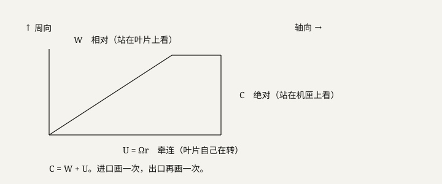

# 第 2 单元 · 相对运动与欧拉做功

读完本单元，你必须能做四件事：

1. 说出 \\(\mathbf{C},\ \mathbf{W},\ \mathbf{U}\\) 各是「谁在看」的速度；
2. 把 \\(M_\\mathrm{rel}\\) 写成 \\(|W|/a\\)，并说明算声速的 \\(T\\) 是静温；
3. 写出最简欧拉式，并指出预测页那格 \\(\\Delta h_0\\) **不是**它；
4. 说出滑块上的 \\(P\\) 是**背压**（出口静压），不是进口总压。

**桥（不需要重学）：** U01 全部（压气机、转子、π η ṁ、总压/静压、静温/总温、γ、R、声速、马赫数、等熵、代理、留出集）；高中物理：圆周运动「线速度 = 角速度 × 半径」、向量加减、功、功率、动能。

**本章新词先看路线（依赖链）：**

```text
弧度/角速度 Ω → 半径 r → 牵连速度 U=Ωr
   → 机匣 / 叶片两个观察者 → 绝对速度 C / 相对速度 W → 速度三角形
   → 相对马赫 M_rel → 叶尖先超音
角动量（高中）→ 动量矩 → 力矩 → 功率 → 欧拉功 Δh₀ → 预旋
   → 与页面「等熵焓升」对照 → 为什么网络里没有它
工况 → 背压 P → 特性线 → 堵塞边 / 失速边
   → 插值 / 外推 → 422 → abstain（弃权）
```

---

## 2.1 画面：三个人看到三种速度



**本节依赖链：** 弧度 → 角速度 → \\(U=\\Omega r\\) → 两个观察者 → \\(\mathbf{C}=\\mathbf{W}+\\mathbf{U}\\) → \\(M_\\mathrm{rel}\\) → 叶尖先超音。

### 2.1.1 拆词（每个词四件套）

| 中文 | 英文/符号 | 单位 | 一句定义 | 数字例子 |
|---|---|---|---|---|
| 弧度 | radian, rad | rad | 角度单位：1 整圈 = \\(2\\pi\\) 弧度（≈6.283）。\\(2\\pi/60\\approx0.10472\\) 就是「每分钟转 1 圈」折成的每秒弧度数 | 60 rpm = 1 圈/秒 = \\(2\\pi\\) rad/s |
| 角速度 | angular velocity, \\(\\Omega\\) | rad/s | 转子每秒钟转过的角度（弧度）。**本项目必须用 rad/s，不许用 rpm** | 本项目 \\(\\Omega\\approx 1620\\)–\\(1800\\) rad/s |
| rpm | revolutions per minute | 转/分 | 「每分钟转几圈」的俗写单位。**不是**角速度的法定单位，要先换算 | 设计转速 ≈ 17188.7 rpm |
| 半径 | radius, \\(r\\) | m | 从转轴到某点的距离。叶尖 \\(r\\) 大，轮毂（贴轴处）\\(r\\) 小 | Rotor 37 叶尖半径约 0.25 m（公开基准几何量级） |
| 牵连速度 | \\(\\mathbf{U}\\) | m/s | 叶片自己因旋转而具有的线速度：\\(U=\\Omega r\\)，方向沿周向（转动的切线方向） | \\(\\Omega=1800\\) rad/s、\\(r=0.25\\) m → \\(U=450\\) m/s |
| 机匣 | casing | — | 包在叶片外面、不转的外壳。站在机匣上 = 站在实验室地面上 |
| 绝对速度 | \\(\\mathbf{C}\\) | m/s | 站在**机匣上**（地面）看气体的速度 |
| 相对速度 | \\(\\mathbf{W}\\) | m/s | 站在**叶片上**看气体的速度。叶片对你静止，气以 \\(\\mathbf{W}\\) 扑过来 |
| 速度三角形 | velocity triangle | — | 把 \\(\\mathbf{C}=\\mathbf{W}+\\mathbf{U}\\) 画成三角形。进口一张、出口再一张 |
| 相对马赫数 | \\(M_\\mathrm{rel}\\) | 无 | \\(|W|/a\\)。跨音速转子「跨」的主要是这个，不是 \\(|C|/a\\) |
| 叶尖 / 轮毂 / 叶高 | tip / hub / span | — | 叶片最外缘 / 最靠近轴。叶高 0% = 轮毂，100% = 叶尖 |

**一句话钉死三个速度的关系**（向量加法，高中知识）：

\\[
\\mathbf{C}=\\mathbf{W}+\\mathbf{U}
\\]

三个量必须在**同一点、同一时刻**谈。进口画一次，出口再画一次。

**换算算例（必会）：** rpm → rad/s，乘 \\(2\\pi/60\\approx 0.10472\\)：

\\[
\\Omega=17188.7\\times 0.10472\\approx 1800\\ \\mathrm{rad/s}
\\]

有人把滑块标成 rpm 就用，\\(U\\) 会错 \\(2\\pi/60\\approx 9.55\\) 倍。

### 2.1.2 为什么先超音的是叶尖

\\(U=\\Omega r\\)：同一 \\(\\Omega\\)，\\(r\\) 越大 \\(U\\) 越大，通常 \\(|W|\\) 也越大。叶尖 \\(r\\) 最大，所以叶尖 \\(M_\\mathrm{rel}\\) 先过 1。Rotor 37 公开设计值大约叶尖 \\(M_\\mathrm{rel}\\approx 1.48\\)——**这是文献/基准的典型数，不是我们 SU2 跑出来的，不能当 E4**（E 档的名字 U11 才系统讲，这里先记住这句限定）。

**声速的陷阱（U01 已埋伏，这里考）。** \\(a=\\sqrt{\\gamma R T}\\) 里的 \\(T\\) 是**静温**。用总温会把 \\(a\\) 算大、把马赫算小。

**相对超音、绝对亚音可以同时发生（算例）。** \\(\\Omega=1800\\) rad/s、叶尖 \\(U=450\\) m/s，来流绝对速度轴向 \\(|C|=180\\) m/s（轴向 = 沿轴的方向）：

- 相对速度大小 \\(|W|\\approx\\sqrt{450^2+180^2}\\approx 485\\) m/s（向量减法后用勾股定理估）；
- 声速（常温 \\(T=288\\) K）\\(a\\approx 340\\) m/s；
- \\(M_\\mathrm{rel}=485/340\\approx 1.43>1\\)：叶片看气流是**超音速**；
- \\(M=|C|/a=180/340\\approx 0.53<1\\)：机匣看气流是**亚音速**。

跨音速转子的「跨」就是这么来的：**同一片叶子上，一个观察者看超音、另一个看亚音**。

**边界。** \\(\\Omega\\) 拉高，同样半径上 \\(U\\) 变大，\\(M_\\mathrm{rel}\\) 升高，通道里激波会变强（激波在 U03 定义）。所以「转得欢三项一起好」物理上不可信；代理若在训练盒子边上吐出三项同升，先怀疑外推（外推在本章 2.3 定义），不要写成物理发现。

**本节自检：**
- [ ] \\(\\mathbf{C}=\\mathbf{W}+\\mathbf{U}\\) 里三个速度各是谁在看？
- [ ] 17188.7 rpm ≈ 多少 rad/s？错用 rpm 会错几倍？
- [ ] 相对超音、绝对亚音能同时发生吗？为什么？
- [ ] \\(T=250\\) K 时声速约多少？（\\(a=\\sqrt{1.4\\times287\\times250}\\approx 317\\) m/s）

### 练习 2.1

**U02-S1-Q01 [易]【选】** \\(\\Omega\\) 必须用的单位是  
A. rpm  
B. rad/s  
C. Hz  
D. deg/s  

**U02-S1-Q02 [易]【选】** 叶尖 \\(M_\\mathrm{rel}\\approx 1.48\\) 属于  
A. 我们 SU2 的 E4  
B. 公开基准典型值  
C. 代理预测  
D. 实验测得  

**U02-S1-Q03 [中]【填】** \\(\\mathbf{C}=\\mathbf{W}+\\mathbf{U}\\) 中 C/W/U 中文：______、______、______。  

**U02-S1-Q04 [中]【填】** 17188.7 rpm \\(\\approx\\) ______ rad/s（约到十位）。  

**U02-S1-Q05 [中]【问】** 为何叶尖 \\(M_\\mathrm{rel}\\) 比轮毂大？  
**U02-S1-Q06 [中]【问】** 相对超音、绝对亚音可能同时发生吗？为什么？  
**U02-S1-Q07 [中]【问】** \\(\\Omega\\) 升高、几何不变，激波变强还是变弱？根据是哪条链？  
**U02-S1-Q08 [中]【问】** 本项目 \\(\\Omega\\) 大约范围，单位写对。  
**U02-S1-Q09 [中]【问】** 「站在叶片上 / 机匣上」各看到哪个速度？  
**U02-S1-Q10 [难]【问】** \\(M_\\mathrm{rel}=1.48,T=250\\,\\mathrm{K}\\)，估 \\(|W|\\)（先写出 \\(a\\)）。

---

## 2.2 欧拉做功：功从周向动量来

**本节依赖链：** 角动量（高中）→ 动量矩 → 力矩 → 功率 → 单位质量功 → 欧拉式 \\(\\Delta h_0=U_2C_{\\theta2}-U_1C_{\\theta1}\\) → 预旋 → 与页面等熵焓升对照 → PINN（只记名字，U06）。

### 2.2.1 拆词

| 中文 | 英文/符号 | 单位 | 一句定义 | 数字例子 |
|---|---|---|---|---|
| 角动量 / 动量矩 | angular momentum | kg·m²/s | 高中角动量：质量 × 速度 × 到转轴的垂直距离。转轴看气体「带多少旋转的量」 | 见 2.2.3 算例 |
| 力矩 | torque | N·m | 力 × 力臂（高中）。让转轴转起来或停下来的「劲」 |
| 功率 | power | W | 单位时间做的功（高中）。转动时：功率 = 力矩 × 角速度 |
| 滞止焓 / 总焓 | \\(h_0\\) 或 \\(h_t\\) | J/kg | U01 已定义：把气刹停后它含的焓。压气机做功主要抬它 |
| 周向分速 | \\(C_\\theta\\) | m/s | 绝对速度 \\(\\mathbf{C}\\) 沿**周向**（转动切线方向）的分量。下标 1 进口、2 出口 |
| 预旋 | pre-swirl | — | 进口气流**本来就有**的 \\(C_{\\theta1}\\)。进口导叶常用来给预旋 |
| 欧拉做功方程 | Euler work equation | — | 轴流最简：单位质量 \\(\\Delta h_0=U_2C_{\\theta2}-U_1C_{\\theta1}\\)（同一半径假设） |
| 理论功 | Euler work | J/kg | 不计损失时，动量矩变化对应的焓升 |
| 等熵焓升 | isentropic \\(\\Delta h_0\\) | J/kg | U01 已定义：同样 \\(\\pi\\)、过程等熵时该有的焓升。预测页那格是这个 |
| PINN | Physics-Informed Neural Network | — | **名字先记，U06 才拆**：把微分方程残差写进神经网络损失的做法。本章只要记住：页面公式 ≠ PINN |

### 2.2.2 公式怎么来的（三步，高中物理够用）

1. **叶片推气体**：气体被沿周向推，它的角动量（动量矩）变了。变多少 = 叶片给了多少「旋转的劲」。
2. **功率 = 力矩 × 角速度**：单位时间内，这份功 = 动量矩变化率 × \\(\\Omega\\)。
3. **除以质量流量就是单位质量功**。对轴流级、忽略径向掺混和间隙泄漏，同一半径上下标 1、2：

\\[
\\Delta h_0=U_2 C_{\\theta 2}-U_1 C_{\\theta 1}
\\]

量纲自查：\\(U\\)（m/s）× \\(C_\\theta\\)（m/s）= m²/s² = J/kg。✓

进口几乎没有预旋时 \\(C_{\\theta1}\\approx 0\\)，\\(\\Delta h_0\\approx U_2 C_{\\theta2}\\)。预旋 \\(C_{\\theta1}>0\\) 时减项变大，同样出口周向速度下理论功**变小**。

**完整算例。** \\(U_1=U_2=450\\) m/s，\\(C_{\\theta1}=0\\)，\\(C_{\\theta2}=150\\) m/s：

\\[
\\Delta h_0=450\\times150-450\\times0=67500\\ \\mathrm{J/kg}=67.5\\ \\mathrm{kJ/kg}
\\]

对比 U01 的页面算例（\\(\\pi=2.05\\) → 等熵焓升 ≈ 66 kJ/kg）：**量级相近、意思完全不同**。一个问「叶片实际传了多少功」，一个问「压到同样的压比、理想过程该要多少功」。

### 2.2.3 它和预测页那格不是同一个量

| | 欧拉 \\(\\Delta h_0\\) | 预测页那格 \\(\\Delta h_0\\) |
|---|---|---|
| 来源 | 速度三角形 / 动量矩 | \\(c_p T_{t1}(\\pi^{0.2857}-1)\\) |
| 是什么 | 叶片实际传给气的功（理想化、无损失时是理论功） | **等熵**过程达到同一 \\(\\pi\\) 所需的焓升 |
| 本仓库 | **没有**作为网络输出，也没有进损失 | 前端用预测出来的 \\(\\pi\\) 现场算的参考 |

**为什么网络不可能「内部在用欧拉」。** 欧拉式要进出口的 \\(U\\) 和 \\(C_\\theta\\)。特征里没有 \\(C_\\theta\\) 场，也没有叶尖半径这个旋钮，只有坐标的统计量（74 维怎么构造在 U05 讲）。网络看见的是 74 个统计数，学的是「统计量 → 三个标量」的拟合，不是在积分动量矩。「我接了欧拉做功」若让人听成「网络里嵌了欧拉方程」，就越档（越档的定义在 U11）。给郭老师的信第 4 稿已经改成：页面参考；网络只有输出边界惩罚（边界惩罚在 U06）。

**边界。** 欧拉功升高，\\(\\pi\\) 倾向升高；激波变强时 \\(\\eta\\) 可以掉。所以只提高 \\(U\\)、不改折转，\\(\\pi\\) 与 \\(\\eta\\) **不必同号**。理论功与实际滞止焓升之差，工程上归到**损失**（损失这个词 U03 用激波和附面层填满）。

**本节自检：**
- [ ] 默写最简欧拉式；\\(C_{\\theta1}=0\\) 时简化成什么？
- [ ] 欧拉功和等熵焓升何时才谈得上相等？（回答：无损失且过程等熵时）
- [ ] 页面那格 \\(\\Delta h_0\\) 是网络输出吗？是欧拉方程进了网络吗？
- [ ] 「欧拉写进残差网所以是 PINN」错在哪？（答：损失里没有欧拉残差）

### 练习 2.2

**U02-S2-Q01 [易]【选】** \\(C_\\theta\\) 是  
A. 径向分量  
B. 轴向分量  
C. 周向分量  
D. 声速  

**U02-S2-Q02 [易]【选】** 页面那格 \\(\\Delta h_0\\) 在仓库里  
A. 是网络输出  
B. 写进了损失  
C. 前端用预测 \\(\\pi\\) 算的等熵参考  
D. CFD 积分  

**U02-S2-Q03 [中]【填】** 轴流最简欧拉式：\\(\\Delta h_0=\\)______。  

**U02-S2-Q04 [中]【填】** 进口无预旋时 \\(\\approx\\)______。  

**U02-S2-Q05 [中]【问】** 欧拉功和等熵焓升何时才谈得上相等？  
**U02-S2-Q06 [中]【问】** 为何网络不可能「内部在用欧拉方程」？  
**U02-S2-Q07 [中]【问】** 边界惩罚含欧拉残差吗？  
**U02-S2-Q08 [中]【问】** 理论功与实际滞止焓升之差通常叫什么？  
**U02-S2-Q09 [中]【问】** 改错：「欧拉写进残差网所以是 PINN。」  
**U02-S2-Q10 [难]【问】** 只提高 \\(U\\)、不改折转：欧拉功怎样变？\\(\\pi\\) 与 \\(\\eta\\) 为何不必同号？

---

## 2.3 两个工况旋钮：Ω 和背压 P

**本节依赖链：** 工况 → 背压 → 特性线 → 堵塞边 / 失速边 → 插值 / 外推 → 422 → abstain → FEATURE_STATS（名字）→ 标准化（名字，U06 才拆）。

### 2.3.1 拆词

| 中文 | 英文/符号 | 单位 | 一句定义 | 数字例子 |
|---|---|---|---|---|
| 工况 | operating condition | — | 这台机器现在跑在哪一点：转多快、下游堵多紧 |
| 背压 | back pressure, \\(P\\) | Pa | **出口静压**（U01 定义过静压）。用来节流。**不是进口总压**。旧页签错过 | 出口静压从 100 kPa 提到 130 kPa = 加背压 |
| 节流阀 | throttle | — | 实验台上拧在出口的阀门。拧紧 = 下游堵住 = 背压升高 |
| 特性线 | speed line | — | 固定转速、改背压，得到的一条 \\(\\dot m\\)–\\(\\pi\\) 曲线 |
| 堵塞边 | choke（复习 U01） | — | 喉部到声速，再降背压 \\(\\dot m\\) 几乎不再增加的那一端 |
| 失速边 | stall | — | 流量过小、分离扩大、接近失速的一端。\\(\\dot m\\) 比堵塞边更小 |
| 插值 | interpolation | — | 在训练见过的 \\(\\Omega,P\\) 盒子里问代理 |
| 外推 | extrapolation | — | 问到盒子外面。本项目部署上应拒绝 |
| HTTP 状态码 | HTTP status code | — | 网页服务器回答请求时带的编号。404 = 页面不存在（日常见过）；**422 = 请求格式对、但内容服务器不处理** |
| 422 | HTTP 422 | — | 本项目约定：输入越出 `FEATURE_STATS` 的 min–max 时，接口返回 422、不给数 |
| abstain | 弃权 | — | 系统承认「我不该回答」并拒绝。422 是它的雏形 |
| FEATURE_STATS | — | — | **名字先记**：`backend/app/model.py` 里存的每个输入维度的 min/max 字典，用来判越界 |
| 标准化 | standardization | — | **名字先记，U06 才拆**：把数变换成均值 0、标准差 1。送进网络前每个输入都做了 |

### 2.3.2 画面与操作

实验台上改工况，通常动两个东西：**电机转速**，和**出口节流阀**。转速对应 \\(\\Omega\\)。节流阀把下游堵住一点，出口静压升高——这就是加背压 \\(P\\)。

输入里真正的工况只有这两个，不是从三万个表面点算出来的：\\(\\Omega\\)（转速，rad/s）与 \\(P\\)（背压，Pa）。

**特性图**：横轴 \\(\\dot m\\)，纵轴 \\(\\pi\\)，一条转速一条线。沿一条线移动 = 改背压：背压升高 → 通常流量下降，靠近失速边；背压降低 → 流量上升，靠近堵塞边。

### 2.3.3 边界（三条，说错就违规）

1. **代理只在训练见过的 \\(\\Omega,P\\) 范围内插值。** 超出 `FEATURE_STATS` 的 min–max，接口应返回 422，不吐数。这是 abstain 的雏形：承认自己不该回答，而不是硬外推。证据档要到 U11 才系统讲；现在先记住：422 是工程策略，不是 E4。
2. **不能叫「全工况智能优化」。** 我们没有把进口总温、进口总压当独立标签去扫完整特性面。
3. **\\(U=\\Omega r\\) 需要半径。** 坐标统计量（U05 拆）不是叶尖半径旋钮；经标准化之后的 \\(\\Omega\\) 也不是 rad/s 的物理值了，是标准化后的数——物理讨论仍用 rad/s，不要把标准化值当成转速。

**本节自检：**
- [ ] \\(P\\) 是背压还是进口总压？背压是哪一侧的静压？
- [ ] 沿一条特性线移动，动的是哪个变量？往堵塞边走是加还是减压？
- [ ] 越界时接口返回什么？abstain 是什么意思？
- [ ] 为什么说「全工况智能优化」是越档？

### 练习 2.3

**U02-S3-Q01 [易]【选】** \\(P\\) 是  
A. 进口总压  
B. 背压（出口静压）  
C. 叶面静压均值  
D. 雷诺数  

**U02-S3-Q02 [易]【选】** 背压升高，沿一条转速线通常  
A. 往堵塞边  
B. 往失速边  
C. \\(\\dot m\\) 不变  
D. \\(\\pi\\) 必降到 1  

**U02-S3-Q03 [中]【填】** 两个工况旋钮：______ 和 ______。  

**U02-S3-Q04 [中]【填】** 越界拒绝看字典 ______，HTTP 码 ______。  

**U02-S3-Q05 [中]【问】** 为何不能说全工况智能优化？  
**U02-S3-Q06 [中]【问】** Coordinate 统计量能代替叶尖半径吗？  
**U02-S3-Q07 [中]【问】** 特性图横轴纵轴通常是什么？  
**U02-S3-Q08 [中]【问】** 外推和插值在本项目部署上的政策？  
**U02-S3-Q09 [中]【问】** 改错：「P 是级入口滞止总压。」  
**U02-S3-Q10 [难]【问】** 只拉 \\(\\Omega\\) 让代理「三项全好」为何物理上不可信？

---

## 单元卷 U02（30 题）

**U02-E-Q01 [易]【选】** \\(M_\\mathrm{rel}=\\) A. \\(|C|/a\\) B. \\(|W|/a\\) C. \\(U/a\\) D. \\(\\Omega r/c_p\\)  
**U02-E-Q02 [易]【选】** 声速：A. \\(\\sqrt{\\gamma RT}\\)（静温） B. \\(\\sqrt{\\gamma R T_t}\\) C. \\(\\Omega r\\) D. \\(c_p T\\)  
**U02-E-Q03 [易]【选】** 设计转速量级：A. 17188.7 rpm B. 1620 rpm C. 1000 rpm D. 3600 rpm  
**U02-E-Q04 [易]【选】** 422 表示：A. 预测成功 B. 拒绝外推 C. 服务器崩溃 D. RANS 收敛  
**U02-E-Q05 [中]【选】** 预旋 \\(C_{\\theta1}>0\\) 时理论功：A. 变大 B. 变小 C. 不变 D. 变负  
**U02-E-Q06 [中]【选】** 失速边相对堵塞边 \\(\\dot m\\)：A. 更大 B. 更小 C. 相等 D. 无定义  
**U02-E-Q07 [易]【填】** 速度三角形三个速度：______、______、______。  
**U02-E-Q08 [易]【填】** \\(\\Omega\\) 误标成 rpm，\\(U\\) 大约错 ______ 倍。  
**U02-E-Q09 [中]【填】** 相对马赫用______温算 \\(a\\)。  
**U02-E-Q10 [中]【填】** 欧拉功量纲：______。  
**U02-E-Q11 [中]【填】** 「跨」的是______马赫。  
**U02-E-Q12 [中]【填】** 1.48 写进信的正确定语：______。  
**U02-E-Q13 [中]【问】** 为何叶尖先超音？  
**U02-E-Q14 [中]【问】** 欧拉方程忽略哪两个三维效应？  
**U02-E-Q15 [中]【问】** 页面焓升不随 \\(\\eta\\) 变，是 bug 还是定义？  
**U02-E-Q16 [中]【问】** 本项目有进出口 \\(C_\\theta\\) 场吗？  
**U02-E-Q17 [中]【问】** 实验台「节流」动哪个阀、对应哪个变量？  
**U02-E-Q18 [中]【问】** FEATURE_STATS 越界是不是 abstain？现在能说到哪一档？  
**U02-E-Q19 [中]【问】** 经 scaler_X 后 \\(\\Omega\\) 还是 rad/s 吗？  
**U02-E-Q20 [中]【问】** 改错：「转速拉高，三项一定一起升。」  
**U02-E-Q21 [中]【问】** \\(U\\) 沿叶高变化如何造成有的截面亚音、有的超音？  
**U02-E-Q22 [中]【问】** 信为何强调 P 不是进口总压？  
**U02-E-Q23 [中]【问】** 「插值」在训练盒子里的操作定义。  
**U02-E-Q24 [中]【问】** 进口总温升高，同样 \\(|W|\\) 的 \\(M_\\mathrm{rel}\\) 怎样变？  
**U02-E-Q25 [中]【问】** 哪个公式可以上页面，哪个不能写进模型架构？  
**U02-E-Q26 [中]【问】** 文字描述进口速度三角形。  
**U02-E-Q27 [中]【问】** 为何仅 \\(\\Omega,P\\) 扫不出完整特性面？  
**U02-E-Q28 [难]【问】** 欧拉功不变、损失增大时，\\(\\pi\\) 和 \\(\\eta\\) 谁先掉？  
**U02-E-Q29 [难]【问】** 「\\(\\Delta h_0\\) 是 CFD 积分出来的吗？」三句以内。  
**U02-E-Q30 [难]【问】** 还缺什么独立量才能谈全特性？

---

## 章末：本章新词总表（索引，忘了回来查）

| 词 | 符号 | 定义位置 | 一句话 |
|---|---|---|---|
| 角速度 / rpm 换算 | \\(\\Omega\\) | 2.1.1 | rad/s；×0.10472 换算；本项目约 1620–1800 rad/s |
| 牵连 / 绝对 / 相对速度 | \\(U\\) / \\(C\\) / \\(W\\) | 2.1.1 | 叶片自己 / 机匣看气 / 叶片看气；\\(C=W+U\\) |
| 相对马赫数 | \\(M_\\mathrm{rel}\\) | 2.1.1 | \\(\\|W\\|/a\\)，\\(a\\) 用静温算；叶尖公开基准 ≈1.48 |
| 动量矩 / 力矩 / 功率 | — | 2.2.1 | 角动量；力×力臂；力矩×角速度 |
| 欧拉做功方程 | \\(\\Delta h_0\\) | 2.2.2 | \\(U_2C_{\\theta2}-U_1C_{\\theta1}\\)，J/kg |
| 周向分速 / 预旋 | \\(C_\\theta\\) | 2.2.1 | 绝对速度的周向分量；进口本来就有的 \\(C_{\\theta1}\\) |
| 理论功 | — | 2.2.1 | 不计损失时的动量矩焓升 |
| PINN | — | 2.2.1 | 名字，U06 拆；页面公式 ≠ PINN |
| 工况 / 背压 | — / \\(P\\) | 2.3.1 | 转多快+下游堵多紧；背压 = 出口静压 |
| 特性线 / 堵塞边 / 失速边 | — | 2.3.1 | 定转速改背压的 ṁ–π 曲线；两端 |
| 插值 / 外推 | — | 2.3.1 | 盒子内问 / 盒子外问（部署上拒绝） |
| 422 / abstain | — | 2.3.1 | 越界拒绝的 HTTP 码；弃权策略的雏形 |

**仓库指认（现在就做一遍）：**
1. 打开 `frontend/src/pages/PredictPage.jsx`，找 `1.005 * 288.15 *`，那一段就是页面等熵焓升公式；
2. 打开 `backend/app/model.py`，找 `FEATURE_STATS`，看每个维度的 min/max——这就是 422 判越界用的字典；
3. 打开 `evidence/data_card.md`，看转速单位与范围（rad/s），并确认数据集许可（CC BY-SA）。
