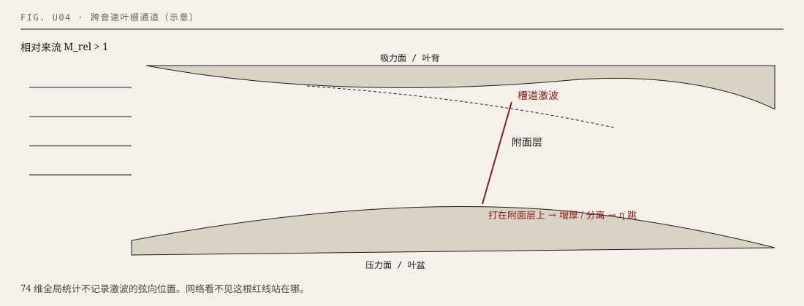

# 第 3 单元 · 激波、附面层与 Rotor 37

离开本单元，你必须能：用自己的话定义激波和附面层（不说基波、负面层）；说出 SWBLI 是激波的逆压打在贴壁薄层上；区分「代理点 21.74 kg/s @ η≈0.873」和「我们拍到的激波照片」（后者没有）。

U01–U02 已会：\(\pi,\eta,\dot m\)，\(M_\mathrm{rel}\)，叶尖先超音。本章回答：为什么 \(\eta\) 比另外两个尖。

图上虚线是贴壁的附面层，陡的那道是槽道激波。

---

## 3.1 激波：超音速里的压力陡坎

先认词：

| 中文 | 英文 | 一句操作定义 |
|---|---|---|
| 激波 | shock | 超音速流里的压力陡坎。几个网格内压强猛升，马赫掉到亚音，熵增加。禁止说「基波」 |
| 等熵波 | isentropic wave | 可逆的弱扰动，如声波。激波不是它 |
| 正激波 | normal shock | 来流垂直于波面。同样来流马赫下压比最大 |
| 斜激波 | oblique shock | 波面与来流不垂直。法向马赫更小，通常更弱 |
| 槽道激波 | passage shock | 叶栅通道里被两边壁面约束的那道激波，往往略斜 |
| 逆压梯度 | adverse pressure gradient | 顺着流向压力升高。流体要爬这个坡 |
| Rankine–Hugoniot | R–H | 正激波两侧压比、密度比随来流马赫数的关系 |

**画面。** 超音速气流撞上一道几乎不连续的坎：前面快、压强较低；后面突然变慢、压强升高。坎很薄，数值网格上通常只占几个格子。

**拆词。** 它不是声波。声波可逆、等熵、很弱。激波不可逆，穿过它熵一定增加。口误「基波」一律改回激波。

**公式。** 正激波压比（\(\gamma=1.4\)）：

\[
\frac{p_2}{p_1}=1+\frac{2\gamma}{\gamma+1}(M^2-1)
\]

\(M=1.48\) 代入约 2.39。叶栅里不能直接用：通道里是斜的、三维的，还有附面层。这个式子只建立数量级：来流马赫升高，正激波压比升高。

波后必亚音（正激波），逆压梯度陡。

**数据。** 叶尖公开 \(M_\mathrm{rel}\approx 1.48\)（U02）。同一片子上叶尖 \(U=\Omega r\) 更大，激波通常比轮毂强。

**边界。** 斜激波的法向马赫小于来流马赫，通常比正激波弱。叶栅里常见槽道激波，不要当成孤立正激波作业题。

---

## 3.2 附面层，以及激波打在它上面

先认词：

| 中文 | 英文 | 一句操作定义 |
|---|---|---|
| 附面层 | boundary layer | 贴壁的薄粘性剪切层。壁面速度 0（无滑移），向外恢复到主流。禁止说负面层 |
| 无滑移 | no-slip | 壁面上流体速度等于壁面速度；静止壁就是 0 |
| 吸力面 / 叶背 | suction side | 压力较低、气流加速的那一面 |
| 压力面 / 叶盆 | pressure side | 压力较高的那一面。高是因为折转，不是「凹坑挤气」 |
| 转捩 | transition | 附面层从层流变成湍流 |
| 分离 | separation | 近壁流体不再贴壁向下游走，出现回流或脱离 |
| SWBLI | shock-wave / boundary-layer interaction | 激波的逆压打在附面层上，层变厚甚至分离 |
| 喉部 | throat | 相邻叶片通道最窄截面。堵塞发生在这里 |

**画面。** 壁面上速度必须是 0。往外很短的距离内速度爬回主流。这一薄层是流动结构，不是氧化膜。

**拆词。** 层流摩阻小、抗逆压弱。转捩成湍流更能抗分离，但掺混损失更大。吸力面附面层本来就在逆压里爬。

**操作。** 激波一立，波后压力陡升。逆压打在吸力面附面层上：层变厚，重则分离。分离泡里低能流体和主流掺混，熵跳一下。\(\eta\) 对「激波站在弦向何处」极敏感，接近间断；\(\pi\) 是进出口积分，没那么尖。

喉部先到声速。再降背压，\(\partial\dot m/\partial P\) 接近 0。不是燃烧室进口。

**数据。** 代理最大流量点 \(\dot m\approx 21.74\,\mathrm{kg/s}\) 时 \(\eta\approx 0.873\)，相对 0.9173 掉了一截。叙事：靠近堵塞，槽道激波增强，吸力面分离。这两个数是代理点（后文 E2）。激波掀附面层是公开机理直觉，不是我们拍到的场。

**边界。** 把激波抹成等熵压缩会高估 \(\eta\)。优化页看最大流量附近，是为了看见权衡，不是只看 0.9173。

仓库指认：`evidence/metrics.json` → `nsga2_surrogate`。图：`教材/figures/U04-shock-bl.svg`。

---

## 3.3 Rotor 37 是谁，不是谁；位置以后会被抹掉

NASA Rotor 37：高负荷进口级转子，Reid & Moore 等报告，CFD 公共考题。PLAID 约 1000 组带标签三维 RANS：几何变 + 工况变。

- 压气机转子，不是涡轮，不是风扇整级，不是涡扇。
- KIT 303 秒是行业引子，不是本项目对象。
- 叶高 0% = 轮毂，100% = 叶尖。

U05 会把每个样本收成 74 个数。那是全局统计，激波在弦向、叶高上的位置进不去。网络只能平滑地贴一个接近跳的 \(\eta\)。后文 Dropout 抖的是有效权重，抖不出「激波在 70% 叶高」。这是 U08–U09 里 \(\eta\) 覆盖率差的伏笔。现在先记住这条链。

公共考题的好处：别人能对照。坏处：不是你家可铣的几何家族。

### 练习 3.1

**U03-S1-Q01 [易]【选】** 正激波后马赫数  
A. 仍 >1 B. =1 C. <1 D. 0  

**U03-S1-Q02 [易]【选】** 激波是  
A. 等熵波 B. 增熵的压力陡坎 C. 声波 D. 接触间断  

**U03-S1-Q03 [中]【填】** 口误「基波」应改为______。  

**U03-S1-Q04 [中]【填】** 叶栅里常见的是______激波（passage shock）。  

**U03-S1-Q05 [中]【问】** 为何激波一定增熵？  
**U03-S1-Q06 [中]【问】** 槽道激波和孤立正激波差在哪？  
**U03-S1-Q07 [中]【问】** 波后逆压梯度从哪来？  
**U03-S1-Q08 [中]【问】** 斜激波为何通常比正激波弱？  
**U03-S1-Q09 [中]【问】** 来流 \(M\) 升高，正激波压比升还是降？  
**U03-S1-Q10 [难]【问】** 写出正激波压比公式并代入 \(M=1.48\)；为何叶栅不能直接用该数？

**U03-S2-Q01 [易]【选】** 无滑移是  
A. 壁面速度=主流 B. 壁面速度=0 C. 压力=0 D. 密度=0  

**U03-S2-Q02 [易]【选】** 叶背对应  
A. 压力面 B. 吸力面 C. 轮毂 D. 叶尖  

**U03-S2-Q03 [中]【填】** SWBLI 中文：______。  

**U03-S2-Q04 [中]【填】** 堵塞发生在通道______截面。  

**U03-S2-Q05 [中]【问】** 附面层厚度方向速度怎样变？  
**U03-S2-Q06 [中]【问】** 分离的一种操作定义。  
**U03-S2-Q07 [中]【问】** 为何 \(\eta\) 对激波弦向位置比 \(\pi\) 尖？  
**U03-S2-Q08 [中]【问】** 21.74 kg/s 配 0.873 是 E 几？激波照片是 E 几？  
**U03-S2-Q09 [中]【问】** 叶盆压力高的正确因果。  
**U03-S2-Q10 [难]【问】** 激波向下游移过喉部，堵塞裕度与分离风险怎样变（定性）？

**U03-S3-Q01 [易]【选】** Rotor 37 是  
A. 涡轮数据 B. NASA 压气机转子基准 C. 本实验室实验件 D. KIT 氢燃机叶片  

**U03-S3-Q02 [易]【选】** KIT 303 秒是  
A. 本项目对象 B. 行业引子 C. E4 验证 D. 官方 test  

**U03-S3-Q03 [中]【填】** 叶高 0% 是______，100% 是______。  

**U03-S3-Q04 [中]【填】** 74 维丢掉的是激波的______信息。  

**U03-S3-Q05 [中]【问】** 为何不能叫涡轮数据？  
**U03-S3-Q06 [中]【问】** 「公共考题」对方法论文意味着什么？  
**U03-S3-Q07 [中]【问】** 几何变分 × 工况变分各动什么？  
**U03-S3-Q08 [中]【问】** 把本项目说成「涡扇叶片优化」错几处？  
**U03-S3-Q09 [中]【问】** PLAID 场量有压力，为何仍说看不见激波位置？  
**U03-S3-Q10 [难]【问】** 把「1.48→激波→SWBLI→η 跳→统计丢掉位置→覆盖率 65%」串起来，每步标档。

---

## 单元卷 U03（30 题）

**U03-E-Q01 [易]【选】** 禁止的错词：A. 附面层 B. 负面层 C. 吸力面 D. 激波  
**U03-E-Q02 [易]【选】** 正激波后密度：A. 降 B. 升 C. 不变 D. 变 0  
**U03-E-Q03 [易]【选】** 1.48 是：A. 轮毂 B. 叶尖 C. 平均叶高 D. 静子  
**U03-E-Q04 [易]【选】** 最大流量点代理 η：A. 0.9173 B. 0.873 C. 0.84 D. 0.65  
**U03-E-Q05 [中]【选】** 通常熵增更大的是：A. 斜激波 B. 正激波 C. 等熵波 D. 膨胀波  
**U03-E-Q06 [中]【选】** 堵塞时 \(\partial\dot m/\partial P\) 大约：A. 很大 B. 近 0 C. 无穷 D. 负无穷  
**U03-E-Q07 [易]【填】** 叶背 = ______面；叶盆 = ______面。  
**U03-E-Q08 [易]【填】** 喉部 = 相邻叶片通道______截面。  
**U03-E-Q09 [中]【填】** 「掀开」对应术语______。  
**U03-E-Q10 [中]【填】** 跨音速的「跨」发生在______系（对本转子）。  
**U03-E-Q11 [中]【填】** 图上虚线是______，红线是______。  
**U03-E-Q12 [中]【填】** 信里写激波掀附面层，要补一句：这是______，不是我们拍到的场。  
**U03-E-Q13 [中]【问】** 分离如何提高掺混损失？  
**U03-E-Q14 [中]【问】** 为何 ReLU 网难以表示 η 的跳？  
**U03-E-Q15 [中]【问】** 同一片子上叶尖激波通常比轮毂强还是弱？联系 \(U=\Omega r\)。  
**U03-E-Q16 [中]【问】** 三种会让 η 掉、不一定让 π 同比例掉的机制。  
**U03-E-Q17 [中]【问】** 改错：「堵塞发生在燃烧室进口。」  
**U03-E-Q18 [中]【问】** 改错：「附面层是氧化膜。」  
**U03-E-Q19 [中]【问】** 为何优化页要点最大流量附近给郭老师看？  
**U03-E-Q20 [中]【问】** 熵增和等熵效率的定性关系。  
**U03-E-Q21 [中]【问】** 把激波抹成等熵压缩，η 会被高估还是低估？  
**U03-E-Q22 [中]【问】** 本单元为 U08 埋伏的一句话。  
**U03-E-Q23 [中]【问】** 高负荷对马赫/折转意味着什么？  
**U03-E-Q24 [中]【问】** 公共基准的好处和「不是自家几何家族」的坏处。  
**U03-E-Q25 [中]【问】** 压力面附面层为何通常更不易分离？  
**U03-E-Q26 [中]【问】** 叶盆常凹是几何观察还是压力定义？  
**U03-E-Q27 [中]【问】** 信里该机理直觉可以讲，不能当哪一档照片？  
**U03-E-Q28 [难]【问】** 用控制体说明分离泡如何把机械能变成内能。  
**U03-E-Q29 [难]【问】** 「你看见激波了吗？」如何诚实回答？  
**U03-E-Q30 [难]【问】** 若做 CST，哪个自由度最可能挪动激波位置？自洽即可。
