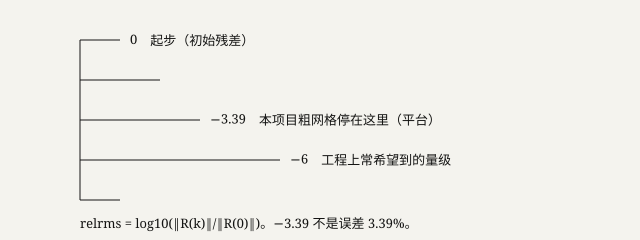

# 第 4 单元 · RANS、网格与残差收敛

离开本单元，你必须能：拆开 CFD、N-S、RANS、DNS；写出 relrms 的定义并解释 −3.39 为什么不是 3.39% 误差、为什么叫未收敛；说出 null 是空着还没填，决策指标现在全是它。

本章「收敛」**只**指：离散方程的残差降到事先定的阈值。不是后文的蒙特卡洛收敛，也不是覆盖率校准。一句话里出现两种，必须点明换了含义。

---

## 4.1 CFD 与 RANS：在格子上解平均场

先认词：

| 中文 | 英文 | 一句操作定义 |
|---|---|---|
| CFD | Computational Fluid Dynamics | 在网格上数值求解流体力学方程 |
| N-S 方程 | Navier–Stokes | 质量、动量、能量守恒，加上本构（如牛顿流体） |
| DNS | Direct Numerical Simulation | 直接解所有湍流尺度。工程上对这个转子太贵 |
| LES | Large Eddy Simulation | 大涡直接解，小涡用模型。比 RANS 贵、比 DNS 便宜 |
| RANS | Reynolds-Averaged Navier–Stokes | 对 N-S **做时间平均**，脉动收进雷诺应力，再用湍流模型封闭 |
| 雷诺应力 | Reynolds stress | 平均之后多出来的、代表脉动输运的项。未知，所以要模型 |
| 封闭 | closure | 用模型把未知的雷诺应力写成可算的量。常见 SA、\(k\)-\(\omega\) SST |
| SU2 | Stanford University Unstructured | 开源求解器。本项目后来补的通路，不是 SUR |

**画面。** 连续的气体被切成很多小格子。每个格子上写离散后的守恒式，用计算机迭代，直到左右两边差不多平衡。这就是 CFD。

**拆词。** N-S 是那组方程。直接解所有漩涡尺度 = DNS，太贵。RANS 的 R 是 Reynolds（雷诺），A 是 Averaged（平均）。平均的是**时间**，不是空间。平均之后出现雷诺应力，方程不封闭，必须加湍流模型。PLAID 的标签和我们打算跑的 SU2，都是 RANS 这一档。

RANS 给出的是平均场，不是每一瞬间的涡。激波在平均场里通常还在，但非定常抖动可能被抹掉。

**操作。** 本项目没有自己产出可用的收敛 RANS 标签。约 1000 组真值来自 PLAID 别人的 RANS。我们的 SU2 是后来补的求解器通路：脚本在，粗网格跑过，细网格没跑完。

**边界。** 「我们用 PINN 解了 N-S」是错的。PINN 要把方程残差写进神经网络损失。本项目训练损失里没有这件事（U06）。SU2 才是求解器，而且还没收敛。

仓库指认：标签来源见 `data_card.md`。SU2 粗网格结果见 `evidence/metrics.json` → `su2_coarse`。

---

## 4.2 网格：切多细、用几阶格式

先认词：

| 中文 | 英文 | 一句操作定义 |
|---|---|---|
| 节点 | node | 格子的顶点。本数据集叶片表面大约 29,773 个 |
| 单元 | cell | 由节点围成的小体积或小面。求解器在单元上积分 |
| 粗网格 / 细网格 | coarse / fine | 格子稀 / 密。细的截断误差小，更贵 |
| 一阶迎风 | first-order upwind | 耗散大的离散格式，激波和剪切层会被抹宽 |
| 二阶格式 | second-order | 耗散更小，激波处更容易振荡，需要限制器 |
| 非流形边 | non-manifold edge | 几何坏了的一种症状。0 条只说明几何检查过，不说明流场收敛 |
| 负体积 | negative volume | 单元翻折。求解器会垮或吐假场 |

**画面。** 连续通道被切成单元。表面节点约 29773（本数据集）。体积网格是另一套，比表面点多得多。

| 本项目 | 规模 | 格式意图 | 结果 |
|---|---|---|---|
| 粗 | 约 14 万单元 | 一阶迎风 | \(\mathrm{relrms}=-3.39\)，`converged=false` |
| 细 | 约 355 万（审计约 3,557,497 节点量级） | 二阶意图 | 本机内存不够，没跑完。不是闭环 |

**操作。** 三维尺度减半，单元数大约 \(\times 8\)。14 万对 355 万，线性尺度大约差 3 倍量级。一阶迎风的副作用是耗散：激波被抹宽，损失可以被抹掉也可以被假造。二阶更少耗散，激波处容易振荡。

**数据。** 点云 2048 是另一套下采样，和表面 29773 不是同一离散。审计里「0 非流形边」是几何检查，不是残差到阈值。

**边界。** 只能跑粗网格时，只许报「粗、一阶、未收敛」的趋势，不许填决策指标，不许说验证完了。

---

## 4.3 残差收敛：−3.39 在梯子的哪一格

先认词：

| 中文 | 英文 | 一句操作定义 |
|---|---|---|
| 残差 | residual \(\mathbf{R}\) | 离散方程左右两边还差多少 |
| relrms | relative RMS | \(\log_{10}\|R^{(k)}\|/\|R^{(0)}\|\)。相对的是**初始残差** |
| 平台 | stall / hang | 残差掉不动了，曲线走平 |
| 发散 | diverge | 残差往上走 |
| null | null | 这里空着、还没有填数。不是 0，也不是考了 0 分 |
| 决策指标 | decision metrics | Spearman、Top-k 等。无收敛 RANS 对照前必须保持 null |

**画面。** 迭代第 \(k\) 步，方程还不平衡，不平衡叫残差。希望它相对第一步小很多。

\[
\mathrm{relrms}=\log_{10}\frac{\|\mathbf{R}^{(k)}\|}{\|\mathbf{R}^{(0)}\|}
\]

**操作。** −3.39 的意思：残差变成初始的约 \(10^{-3.39}\approx 4\times 10^{-4}\)。工程上常希望到 −6（再掉约 2.6 个数量级），并且进出口流量守恒、\(\pi,\eta,\dot m\) 稳住。日志给的是平台：掉不动了。所以 **未收敛**。不是误差 3.39%。

未收敛的场：激波位置可以还在漂，\(\eta\) 可以还在晃。拿它给代理点「验一下」得到的是随机数，不能填 Spearman。

残差到了 −6 但 \(\eta\) 仍震荡，也不算工程收敛。求解器启动了，更不是「E4 完成一半」——E 档的系统名字在 U11，这里先记住：跑过 ≠ 可用。

**三种收敛（先挂上名字，后两行到 U08、U09 才展开）：**

| 名字 | 在收敛的是什么 | 本项目 |
|---|---|---|
| RANS 残差 | 离散方程的不平衡 | −3.39，未收敛 |
| MC 估计量 | 抽样次数够不够 | U08，\(T=100\) 够稳 |
| 覆盖率校准 | 区间是否盖到名义水平 | U09，η 只有 65% |

**数据。** `evidence/metrics.json`：`su2_coarse.relrms_platform = -3.39`，`converged: false`。`decision_metrics` 全部 null。

仓库指认：同上。宪章：收敛 RANS 对照前禁止用代理自比填决策指标。

### 练习 4.1

**U04-S1-Q01 [易]【选】** RANS 平均的是  
A. 空间 B. 时间 C. 只平均压力 D. 不平均  

**U04-S1-Q02 [易]【选】** PLAID 标签是  
A. 本实验室实验 B. 公开 RANS C. 我们收敛的 SU2 D. DNS  

**U04-S1-Q03 [中]【填】** CFD 四词英文：______。  

**U04-S1-Q04 [中]【填】** 尺度从细到粗：DNS > ______ > RANS。  

**U04-S1-Q05 [中]【问】** 雷诺应力为何需要模型？  
**U04-S1-Q06 [中]【问】** 我们自己有没有可用的收敛 RANS 标签？  
**U04-S1-Q07 [中]【问】** SA 是几方程模型？  
**U04-S1-Q08 [中]【问】** RANS 平均场里还能看见激波吗？  
**U04-S1-Q09 [中]【问】** 改错：「我们用 PINN 解了 N-S。」  
**U04-S1-Q10 [难]【问】** 跨音速转子上 RANS 的 η 为何对模型和网格敏感？

**U04-S2-Q01 [易]【选】** 粗网格约  
A. 29773 单元 B. 14 万单元 C. 355 万单元 D. 1000 单元  

**U04-S2-Q02 [易]【选】** 一阶迎风主要副作用  
A. 振荡 B. 耗散抹宽激波 C. 加快收敛到 −8 D. 自动二阶  

**U04-S2-Q03 [中]【填】** 表面节点大约 ______。  

**U04-S2-Q04 [中]【填】** 细网格约 ______ 万，本机结果是______（没跑完/已 E4）。  

**U04-S2-Q05 [中]【问】** 0 非流形边证明流场收敛了吗？  
**U04-S2-Q06 [中]【问】** 节点和单元的区别。  
**U04-S2-Q07 [中]【问】** 二阶格式在激波处的风险。  
**U04-S2-Q08 [中]【问】** 14 万对 355 万，三维线性尺度粗估细多少倍？  
**U04-S2-Q09 [中]【问】** 为何本机内存能卡死细网格？  
**U04-S2-Q10 [难]【问】** 只能跑粗网格时，怎样设计对照才不把 −3.39 当验证？

**U04-S3-Q01 [易]【选】** relrms=−3.39  
A. 已收敛 B. 未收敛 C. 误差 3.39% D. E4  

**U04-S3-Q02 [易]【选】** 工程上常希望 relrms 到  
A. −1 B. −3.39 C. −6 量级 D. +2  

**U04-S3-Q03 [中]【填】** \(\mathrm{relrms}=\log_{10}\)______。  

**U04-S3-Q04 [中]【填】** 决策指标在收敛 RANS 前必须保持 ______。  

**U04-S3-Q05 [中]【问】** 「平台」意味着什么？  
**U04-S3-Q06 [中]【问】** 除残差外还要看哪两个工程判据？  
**U04-S3-Q07 [中]【问】** 未收敛时激波位置可能怎样？  
**U04-S3-Q08 [中]【问】** 三种收敛各用四个字区分。  
**U04-S3-Q09 [中]【问】** 改错：「求解器启动了，所以 E4 完成一半。」  
**U04-S3-Q10 [难]【问】** 给「收敛 RANS 对照」写最小实验方案。

---

## 单元卷 U04（30 题）

**U04-E-Q01 [易]【选】** E3 对应：A. 细网格收敛 B. 粗 14 万一阶 C. 官方 test D. ONNX  
**U04-E-Q02 [易]【选】** `converged`：A. true B. false C. null D. 0.95  
**U04-E-Q03 [易]【选】** SU2：A. 商业 B. 开源 C. 我们自研闭源 D. 实验台  
**U04-E-Q04 [易]【选】** 更耗散的是：A. 一阶 B. 二阶 C. DNS D. 一样  
**U04-E-Q05 [中]【选】** \(10^{-3.39}\) 与 \(10^{-6}\) 差约：A. 0.3 档 B. 2.6 个数量级 C. 6 倍 D. 相同  
**U04-E-Q06 [中]【选】** 「通路已跑通」等于「结果可用」吗？A. 是 B. 否 C. 仅对 η D. 仅对 π  
**U04-E-Q07 [易]【填】** 残差的「相对」相对的是______。  
**U04-E-Q08 [易]【填】** E3 法定三件套：粗网格 / 一阶 / ______。  
**U04-E-Q09 [中]【填】** 三维网格尺度减半，单元数大约 ×______。  
**U04-E-Q10 [中]【填】** data card 许可证：______。  
**U04-E-Q11 [中]【填】** Top-k Recall 现在必须是 ______，因为没有______。  
**U04-E-Q12 [中]【填】** 信里「355 万脚本在、内存不够」是否越档？______。  
**U04-E-Q13 [中]【问】** 数值耗散如何伤或假造激波损失？  
**U04-E-Q14 [中]【问】** 点云 2048 与表面 29773 是否同一离散？  
**U04-E-Q15 [中]【问】** 列出不能用未收敛场做的三件事。  
**U04-E-Q16 [中]【问】** HPC 在宪章里留给什么？  
**U04-E-Q17 [中]【问】** 求解器输入是边界条件还是 74 维统计？  
**U04-E-Q18 [中]【问】** 残差到 −6 但 η 仍震荡，算收敛吗？  
**U04-E-Q19 [中]【问】** 改错：「relrms=−3.39 说明误差 3.39%。」  
**U04-E-Q20 [中]【问】** RANS 模型选错最容易伤 η 的哪个物理？  
**U04-E-Q21 [中]【问】** 本单元收敛和覆盖率收敛能否写在一句里不声明？  
**U04-E-Q22 [中]【问】** 「趋势」允许说什么、不允许说什么？  
**U04-E-Q23 [中]【问】** 截断误差如何依赖格式阶和网格尺度？  
**U04-E-Q24 [中]【问】** 负体积会导致什么？  
**U04-E-Q25 [中]【问】** PLAID 的 RANS 和未来 SU2 都收敛后还要核对什么才可比？  
**U04-E-Q26 [中]【问】** 描述残差曲线：收敛 / 平台 / 发散。  
**U04-E-Q27 [中]【问】** 雷诺平均后连续方程还守恒平均质量吗？  
**U04-E-Q28 [难]【问】** 设计「代理说好、未收敛 RANS 也说好」的虚假胜利及拆穿法。  
**U04-E-Q29 [难]【问】** 「你 CFD 跑了吗？」按发送包答。  
**U04-E-Q30 [难]【问】** 把「接受 RANS 裁决」写成 ≥5 条验收清单。
